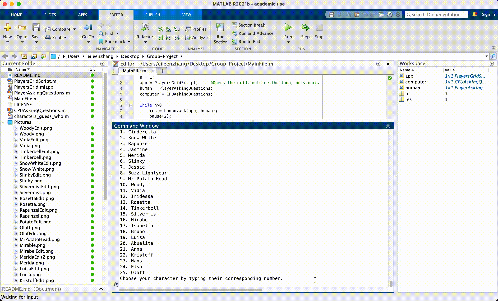
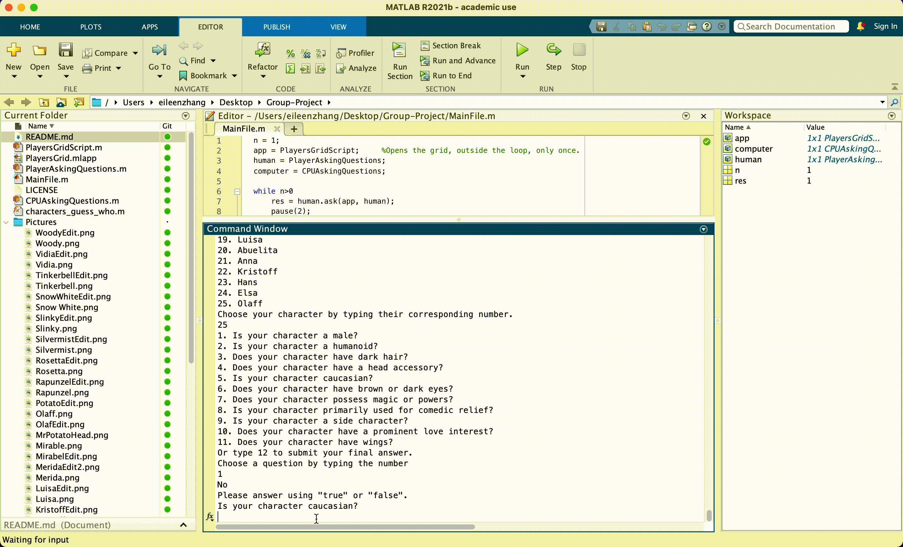

# Group-Project

Tutorial:
Run MainFile.m and choose your character by entering the number in the command window.
A separate window (game interface) will pop up, showing the 25 characters.

You and the computer will ask question in turns, you can click on the icons to remove characters that won't be your final choice.

Then the computer will ask you questions, you can respond true/false in the command window.

Repeat this process for multiple times, until you have 1 character left.
Then you can submit your final answer by entering 12 in the command window.

Notes:
1. When you initially run the file and a bug appears, please set a path for the 'pictures' folder.
2. In the following cases, you lose the game automatically:
    a) The computer finds your character before you find its.
    b) You have 0 or more than 1 character left in your window when you submit.
    c) Your answer is incorrect.

Link to Work Log: https://docs.google.com/document/d/184wdYhUtRxQ5AFnGbl8sLfotnSDLsFAuD7_rsWjiD9A/edit?usp=sharing
